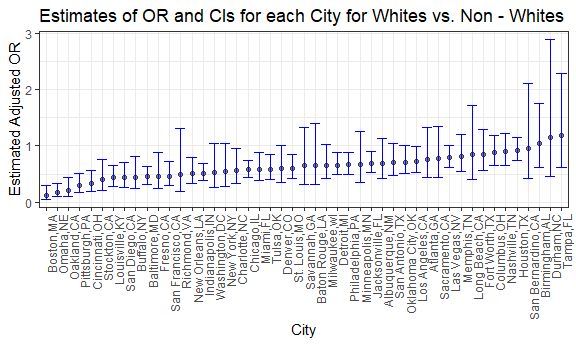
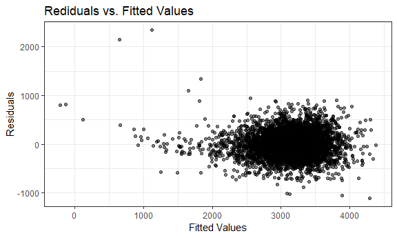

HW 6
================
Jianyou Liu
November 25, 2018

Problem 1
---------

### Homicide Data in Major US Cities

#### Load in dataset

``` r
raw_hom_data = read.csv("https://raw.githubusercontent.com/washingtonpost/data-homicides/master/homicide-data.csv")

head(raw_hom_data)
```

    ##          uid reported_date victim_last victim_first victim_race victim_age
    ## 1 Alb-000001      20100504      GARCIA         JUAN    Hispanic         78
    ## 2 Alb-000002      20100216     MONTOYA      CAMERON    Hispanic         17
    ## 3 Alb-000003      20100601 SATTERFIELD      VIVIANA       White         15
    ## 4 Alb-000004      20100101    MENDIOLA       CARLOS    Hispanic         32
    ## 5 Alb-000005      20100102        MULA       VIVIAN       White         72
    ## 6 Alb-000006      20100126        BOOK    GERALDINE       White         91
    ##   victim_sex        city state      lat       lon           disposition
    ## 1       Male Albuquerque    NM 35.09579 -106.5386 Closed without arrest
    ## 2       Male Albuquerque    NM 35.05681 -106.7153      Closed by arrest
    ## 3     Female Albuquerque    NM 35.08609 -106.6956 Closed without arrest
    ## 4       Male Albuquerque    NM 35.07849 -106.5561      Closed by arrest
    ## 5     Female Albuquerque    NM 35.13036 -106.5810 Closed without arrest
    ## 6     Female Albuquerque    NM 35.15111 -106.5378        Open/No arrest

#### Create city\_state variable and binary variable indicating whether the homicide is solved

``` r
new_hom_data1 = raw_hom_data %>% 
  unite(city, state, col = "city_state", sep = ",") %>% 
  mutate(bin_solved = ifelse(disposition == "Closed without arrest" | disposition == "Open/No arrest", 0, 1))
```

**Note**: '0' = crime unsolved; '1' = crime solved

#### Omit cities Dallas, TX; Phoenix, AZ; and Kansas City, MO – these don’t report victim race. Also omit Tulsa, AL – this is a data entry mistake

``` r
new_hom_data2 = new_hom_data1 %>% 
  filter(city_state != "Dallas,TX", city_state != "Phoenix,AZ", city_state != "Kansas City,MO", city_state != "Tulsa,AL")
```

#### Modifiy victim\_race to have categories white and non-white, with white as the reference category. Make sure that victim\_age is a numeric variable.

``` r
final_hom_data = new_hom_data2 %>% 
  mutate(victim_race = ifelse(victim_race == "White", "White", "Non-White"),
  # Make 'White' as the reference category
  victim_race = fct_relevel(victim_race, ref = "White")) %>% 
  # Convert 'victim_age' into numeric
  mutate(victim_age = as.numeric(victim_age))

head(final_hom_data, n = 10)
```

    ##           uid reported_date  victim_last victim_first victim_race
    ## 1  Alb-000001      20100504       GARCIA         JUAN   Non-White
    ## 2  Alb-000002      20100216      MONTOYA      CAMERON   Non-White
    ## 3  Alb-000003      20100601  SATTERFIELD      VIVIANA       White
    ## 4  Alb-000004      20100101     MENDIOLA       CARLOS   Non-White
    ## 5  Alb-000005      20100102         MULA       VIVIAN       White
    ## 6  Alb-000006      20100126         BOOK    GERALDINE       White
    ## 7  Alb-000007      20100127    MALDONADO        DAVID   Non-White
    ## 8  Alb-000008      20100127    MALDONADO       CONNIE   Non-White
    ## 9  Alb-000009      20100130 MARTIN-LEYVA      GUSTAVO       White
    ## 10 Alb-000010      20100210      HERRERA       ISRAEL   Non-White
    ##    victim_age victim_sex     city_state      lat       lon
    ## 1          79       Male Albuquerque,NM 35.09579 -106.5386
    ## 2          12       Male Albuquerque,NM 35.05681 -106.7153
    ## 3          10     Female Albuquerque,NM 35.08609 -106.6956
    ## 4          29       Male Albuquerque,NM 35.07849 -106.5561
    ## 5          73     Female Albuquerque,NM 35.13036 -106.5810
    ## 6          94     Female Albuquerque,NM 35.15111 -106.5378
    ## 7          51       Male Albuquerque,NM 35.11178 -106.7126
    ## 8          51     Female Albuquerque,NM 35.11178 -106.7126
    ## 9          55       Male Albuquerque,NM 35.07538 -106.5535
    ## 10         41       Male Albuquerque,NM 35.06593 -106.5723
    ##              disposition bin_solved
    ## 1  Closed without arrest          0
    ## 2       Closed by arrest          1
    ## 3  Closed without arrest          0
    ## 4       Closed by arrest          1
    ## 5  Closed without arrest          0
    ## 6         Open/No arrest          0
    ## 7       Closed by arrest          1
    ## 8       Closed by arrest          1
    ## 9         Open/No arrest          0
    ## 10        Open/No arrest          0

### Baltimore, MD Linear Model Analysis

#### Fit logistic regression with resolved vs unresolved as the outcome and victim age, sex and race as predictors.

``` r
balt_data = final_hom_data %>% 
  filter(city_state == "Baltimore,MD")

# Save output as R object
fit_glm_balt = balt_data %>% 
  glm(bin_solved ~ victim_age + victim_sex + victim_race, data = ., family = binomial())
```

#### Apply broom::tidy to the object and extract estimate and confidence interval of the adjusted odds ratio

``` r
fit_glm_balt %>% 
  broom::tidy() %>% 
  # Transform log 'Odds Ratio' back; calculate 95% CIs
  mutate(OR = exp(estimate), low_CI = exp(estimate - std.error*1.96), high_CI = exp(estimate + std.error*1.96)) %>% 
  select(term, OR, low_CI, high_CI, p.value) %>% 
  # Compare 'non-white' to 'white victims'
  filter(term == "victim_raceNon-White") %>% 
  knitr::kable(digits = 3)
```

| term                  |     OR|  low\_CI|  high\_CI|  p.value|
|:----------------------|------:|--------:|---------:|--------:|
| victim\_raceNon-White |  0.453|    0.322|     0.637|        0|

**Interpretation**: We can be 95% confident that the odds of resolving a homicide case is between 0.322 and 0.637 times among *non-white* victims than that of *white* victims.

### All City Analysis

#### Run logistic regression for each of the cities; extract the adjusted odds ratio (and CI) for solving homicides comparing non-white victims to white victims

``` r
fit_glm_all = final_hom_data %>% 
  group_by(city_state) %>% 
  # Generate list column
  nest() %>% 
  # Perform glm and broom;tidy for each city
  mutate(logis_model = map(data, ~glm(bin_solved ~ victim_age + victim_sex + victim_race, data = ., family = binomial())), logis_model = map(logis_model, broom::tidy)) %>% 
  select(-data) %>% 
  unnest() %>% 
  # Obtain odds ratio and compute 95% confidence intervals
  mutate(OR = exp(estimate), low_CI = exp(estimate - std.error*1.96), high_CI = exp(estimate + std.error*1.96)) %>% 
  select(city_state, term, OR, low_CI, high_CI, p.value) %>% 
  filter(term == "victim_raceNon-White")

# Display first 10 rows of resulting data frame
head(fit_glm_all, n = 10) %>% 
  knitr::kable(digits = 3)
```

| city\_state    | term                  |     OR|  low\_CI|  high\_CI|  p.value|
|:---------------|:----------------------|------:|--------:|---------:|--------:|
| Albuquerque,NM | victim\_raceNon-White |  0.686|    0.418|     1.127|    0.137|
| Atlanta,GA     | victim\_raceNon-White |  0.767|    0.440|     1.335|    0.348|
| Baltimore,MD   | victim\_raceNon-White |  0.453|    0.322|     0.637|    0.000|
| Baton Rouge,LA | victim\_raceNon-White |  0.656|    0.307|     1.399|    0.275|
| Birmingham,AL  | victim\_raceNon-White |  1.047|    0.623|     1.761|    0.862|
| Boston,MA      | victim\_raceNon-White |  0.121|    0.050|     0.293|    0.000|
| Buffalo,NY     | victim\_raceNon-White |  0.447|    0.245|     0.815|    0.009|
| Charlotte,NC   | victim\_raceNon-White |  0.555|    0.325|     0.948|    0.031|
| Chicago,IL     | victim\_raceNon-White |  0.575|    0.441|     0.750|    0.000|
| Cincinnati,OH  | victim\_raceNon-White |  0.327|    0.190|     0.564|    0.000|

#### Create a plot that shows the estimated ORs and CIs for each city

``` r
fit_glm_all %>% 
  # Organize cities according to increasing estimated ORs
  mutate(city_state = fct_reorder(city_state, OR)) %>% 
  ggplot(aes(x = city_state, y = OR)) +
  geom_point(alpha = .5) +
  geom_errorbar(aes(ymin = low_CI , ymax = high_CI), color = "blue") +
  theme(axis.text.x = element_text(angle = 90, hjust = 1)) +
  labs(
    title = "Estimates of OR and CIs for each City for Whites vs. Non - Whites",
    x = "City",
    y = "Estimated Adjusted OR"
  )
```

 **Comments**: Looking at the estimated ORs, Boston has the least value suggesting that cases in this city involving non-white victims have the lowest chance of being solved than those involving white residents among the all cities in the dataset. Furthermore, the majority of the cities have ORs less than 1, indicating the possibility that homicides done to non-white subjects are at lower odds of being resolved compared with those done to white people in most places. There are 3 cities in which the adjusted ORs are above 1, Birmingham, Durham, Tampa, meaning that these areas probably have opposite phenomenons, that crimes with white victims have less likelihood of being solved.

However, we cannot be entirely sure that the findings are true since by examining the constructed condifence intervals, the intervals for some cities do include the null hypothesized value 1, which signals no association. For these places, we need to investigage their individual p-values to determine whether the estimates are statistically significant or not.

Problem 2
---------

### Variables that affect Child's Birthweight

#### Load and Clean Dataset

``` r
raw_birth_data = read_csv("./data/birthweight.csv")

# Check for missing values
raw_birth_data[!complete.cases(raw_birth_data),]
```

    ## # A tibble: 0 x 20
    ## # ... with 20 variables: babysex <int>, bhead <int>, blength <int>,
    ## #   bwt <int>, delwt <int>, fincome <int>, frace <int>, gaweeks <dbl>,
    ## #   malform <int>, menarche <int>, mheight <int>, momage <int>,
    ## #   mrace <int>, parity <int>, pnumlbw <int>, pnumsga <int>, ppbmi <dbl>,
    ## #   ppwt <int>, smoken <dbl>, wtgain <int>

``` r
# Convert numeric to factor where appropriate
tidy_birth_data = raw_birth_data %>% 
  mutate(babysex = as.factor(babysex), frace = as.factor(frace), mrace = as.factor(mrace), malform = as.factor(malform))

head(tidy_birth_data, n = 10)
```

    ## # A tibble: 10 x 20
    ##    babysex bhead blength   bwt delwt fincome frace gaweeks malform menarche
    ##    <fct>   <int>   <int> <int> <int>   <int> <fct>   <dbl> <fct>      <int>
    ##  1 2          34      51  3629   177      35 1        39.9 0             13
    ##  2 1          34      48  3062   156      65 2        25.9 0             14
    ##  3 2          36      50  3345   148      85 1        39.9 0             12
    ##  4 1          34      52  3062   157      55 1        40   0             14
    ##  5 2          34      52  3374   156       5 1        41.6 0             13
    ##  6 1          33      52  3374   129      55 1        40.7 0             12
    ##  7 2          33      46  2523   126      96 2        40.3 0             14
    ##  8 2          33      49  2778   140       5 1        37.4 0             12
    ##  9 1          36      52  3515   146      85 1        40.3 0             11
    ## 10 1          33      50  3459   169      75 2        40.7 0             12
    ## # ... with 10 more variables: mheight <int>, momage <int>, mrace <fct>,
    ## #   parity <int>, pnumlbw <int>, pnumsga <int>, ppbmi <dbl>, ppwt <int>,
    ## #   smoken <dbl>, wtgain <int>

**Note**: The line of code checking for NAs outputs 0 rows, which indicates that the data does not contain missing values.

#### Propose regression model for birthweight

``` r
# Backward elimination
fit_all = lm(bwt ~ ., data = tidy_birth_data)
summary(fit_all)
step1 = update(fit_all, . ~ . -malform)
summary(step1)
step2 = update(step1, . ~ . -ppbmi)
summary(step2)
step3 = update(step2, . ~ . -frace)
summary(step3)

# Repeat process a number of times to select desirable model
```

The modeling process I used is backwards elimimation, which first fits a multiple linear regression model for all variables, then removing the non-significant ones(p-value &gt; 0.05) one at a time starting with the highest one. Eventually, the predictors that I chose to keep in my model are 'babysex', 'head circumference', 'length', 'mother's weight', 'gestational age', 'mother's height', 'mother's race', 'parity', 'mother's pre-pregnancy weight', and 'smoking status'.

#### Show a plot of model residuals against fitted values

``` r
# Final linear model selected
prop_fit_lm = lm(bwt ~ babysex + bhead + blength + delwt + gaweeks + mheight + mrace + parity + ppwt + smoken, data = tidy_birth_data)

summary(prop_fit_lm)
```

    ## 
    ## Call:
    ## lm(formula = bwt ~ babysex + bhead + blength + delwt + gaweeks + 
    ##     mheight + mrace + parity + ppwt + smoken, data = tidy_birth_data)
    ## 
    ## Residuals:
    ##      Min       1Q   Median       3Q      Max 
    ## -1106.16  -183.65    -2.51   174.67  2338.68 
    ## 
    ## Coefficients:
    ##               Estimate Std. Error t value Pr(>|t|)    
    ## (Intercept) -6101.8188   137.5732 -44.353  < 2e-16 ***
    ## babysex2       28.3735     8.4565   3.355 0.000800 ***
    ## bhead         131.0228     3.4448  38.035  < 2e-16 ***
    ## blength        74.7933     2.0178  37.066  < 2e-16 ***
    ## delwt           4.0840     0.3920  10.419  < 2e-16 ***
    ## gaweeks        11.6785     1.4617   7.990 1.72e-15 ***
    ## mheight         6.8569     1.7795   3.853 0.000118 ***
    ## mrace2       -145.3753     9.2256 -15.758  < 2e-16 ***
    ## mrace3        -77.9781    42.2918  -1.844 0.065279 .  
    ## mrace4       -105.9871    19.1083  -5.547 3.09e-08 ***
    ## parity         94.8103    40.3386   2.350 0.018800 *  
    ## ppwt           -2.6507     0.4273  -6.204 6.02e-10 ***
    ## smoken         -4.8738     0.5855  -8.324  < 2e-16 ***
    ## ---
    ## Signif. codes:  0 '***' 0.001 '**' 0.01 '*' 0.05 '.' 0.1 ' ' 1
    ## 
    ## Residual standard error: 272.4 on 4329 degrees of freedom
    ## Multiple R-squared:  0.7179, Adjusted R-squared:  0.7171 
    ## F-statistic:   918 on 12 and 4329 DF,  p-value: < 2.2e-16

``` r
# Construct plot of residuals vs. fitted values
tidy_birth_data %>% 
  add_predictions(prop_fit_lm) %>% 
  add_residuals(prop_fit_lm) %>% 
  ggplot(aes(x = pred, y = resid)) +
  geom_point(alpha = .5) +
  labs (
    title = "Rediduals vs. Fitted Values",
     x = "Fitted Values",
     y = "Residuals" )
```



### Compare model with 2 others

#### Build the 2 models and display coefficients for predictors

``` r
# Construct the other 2 models as directed
comp_lm_2 = lm(bwt ~ blength + gaweeks, data = tidy_birth_data)
comp_lm_3 = lm(bwt ~ bhead + blength + babysex + bhead * blength + bhead * babysex + blength * babysex + bhead * blength * babysex, data = tidy_birth_data)

summary(comp_lm_2)
```

    ## 
    ## Call:
    ## lm(formula = bwt ~ blength + gaweeks, data = tidy_birth_data)
    ## 
    ## Residuals:
    ##     Min      1Q  Median      3Q     Max 
    ## -1709.6  -215.4   -11.4   208.2  4188.8 
    ## 
    ## Coefficients:
    ##              Estimate Std. Error t value Pr(>|t|)    
    ## (Intercept) -4347.667     97.958  -44.38   <2e-16 ***
    ## blength       128.556      1.990   64.60   <2e-16 ***
    ## gaweeks        27.047      1.718   15.74   <2e-16 ***
    ## ---
    ## Signif. codes:  0 '***' 0.001 '**' 0.01 '*' 0.05 '.' 0.1 ' ' 1
    ## 
    ## Residual standard error: 333.2 on 4339 degrees of freedom
    ## Multiple R-squared:  0.5769, Adjusted R-squared:  0.5767 
    ## F-statistic:  2958 on 2 and 4339 DF,  p-value: < 2.2e-16

``` r
summary(comp_lm_3)
```

    ## 
    ## Call:
    ## lm(formula = bwt ~ bhead + blength + babysex + bhead * blength + 
    ##     bhead * babysex + blength * babysex + bhead * blength * babysex, 
    ##     data = tidy_birth_data)
    ## 
    ## Residuals:
    ##      Min       1Q   Median       3Q      Max 
    ## -1132.99  -190.42   -10.33   178.63  2617.96 
    ## 
    ## Coefficients:
    ##                          Estimate Std. Error t value Pr(>|t|)    
    ## (Intercept)            -7176.8170  1264.8397  -5.674 1.49e-08 ***
    ## bhead                    181.7956    38.0542   4.777 1.84e-06 ***
    ## blength                  102.1269    26.2118   3.896 9.92e-05 ***
    ## babysex2                6374.8684  1677.7669   3.800 0.000147 ***
    ## bhead:blength             -0.5536     0.7802  -0.710 0.478012    
    ## bhead:babysex2          -198.3932    51.0917  -3.883 0.000105 ***
    ## blength:babysex2        -123.7729    35.1185  -3.524 0.000429 ***
    ## bhead:blength:babysex2     3.8781     1.0566   3.670 0.000245 ***
    ## ---
    ## Signif. codes:  0 '***' 0.001 '**' 0.01 '*' 0.05 '.' 0.1 ' ' 1
    ## 
    ## Residual standard error: 287.7 on 4334 degrees of freedom
    ## Multiple R-squared:  0.6849, Adjusted R-squared:  0.6844 
    ## F-statistic:  1346 on 7 and 4334 DF,  p-value: < 2.2e-16

#### Cross Validation for Prediction Error

``` r
# Perform crossv_mc function
cv_df = crossv_mc(tidy_birth_data, 100) %>% 
  mutate(train = map(train, as_tibble), test = map(test, as_tibble))

# Fit models to training data and obtain corresponding RMSEs for testing data
cv_df = cv_df %>% 
  mutate(prop_fit_lm = map(train, ~lm(bwt ~ babysex + bhead + blength + delwt + gaweeks + mheight + mrace + parity + ppwt + smoken, data = .x)), 
         comp_lm_2 = map(train, ~lm(bwt ~ blength + gaweeks, data = .x)), 
         comp_lm_3 = map(train, ~lm(bwt ~ bhead + blength + babysex + bhead * blength + bhead * babysex + blength * babysex + bhead * blength * babysex, data = .x))) %>% 
  mutate(rmse_self = map2_dbl(prop_fit_lm, test, ~rmse(model = .x, data = .y)),
         rmse2 = map2_dbl(comp_lm_2, test, ~rmse(model = .x, data = .y)),
         rmse3 = map2_dbl(comp_lm_3, test, ~rmse(model = .x, data = .y)))
```
